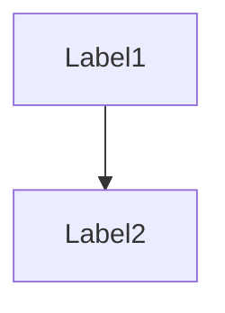

# gh-experiments

Inline $formula=1+1$
$$formula=1+1$$

https://github.com/agoll-habanalabs/gh-experiments/blob/939ff93d868fbdfd71116b7a444c63318bd315d7/some_code.cpp#L3-L5

https://github.com/agoll-habanalabs/gh-experiments/blob/2f38c560e52871ab949749e8088f14c55b4f98df/some_code.cpp#L3-L6
